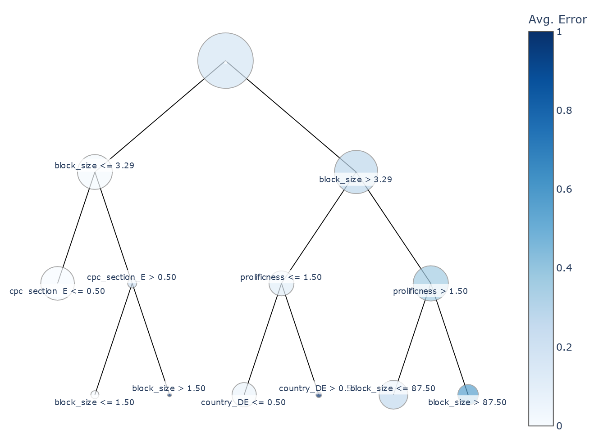
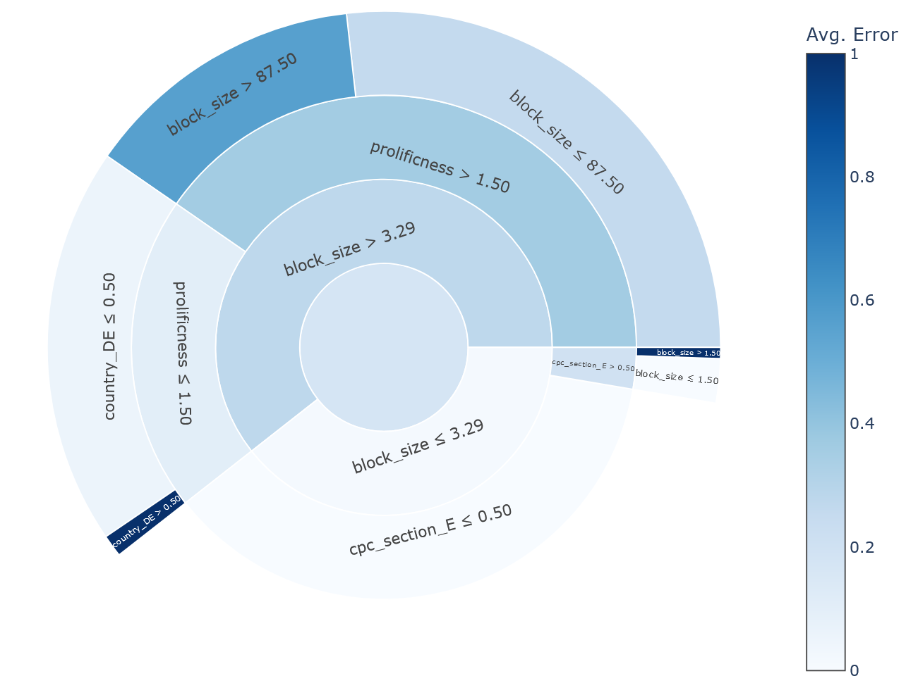
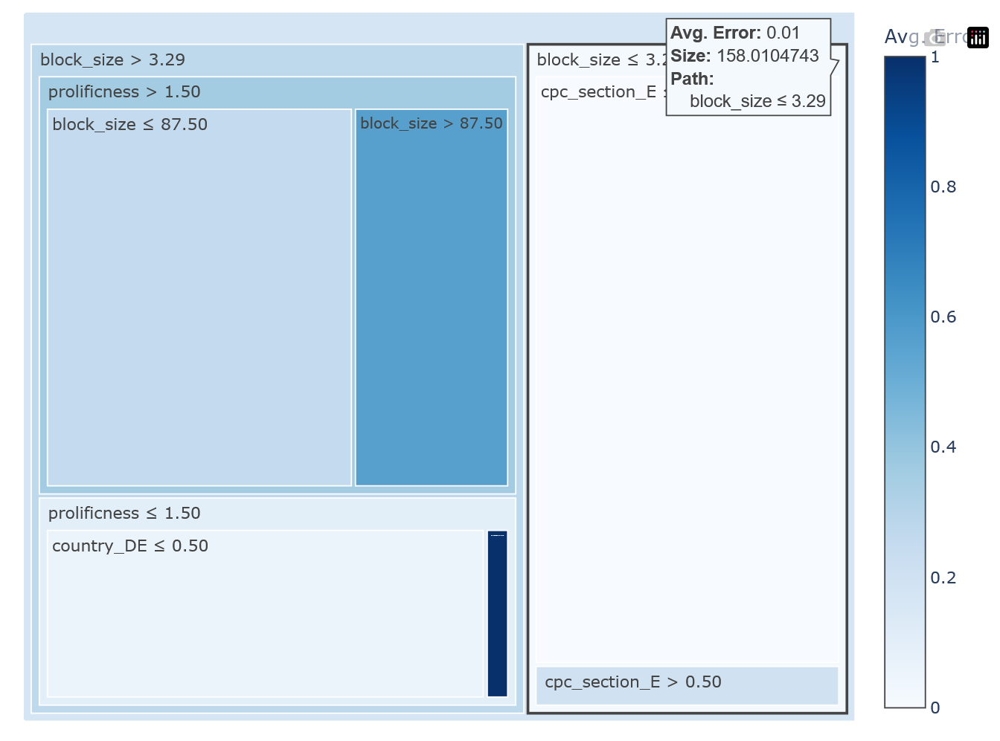

> **Warning**
> 🚧 This package is under early active development. We're planning for a first release in September. Leave a star ⭐, [share your thoughts](https://github.com/OlivierBinette/VisTree/issues/new), and contribute or see you soon! 👋

# 🌴 VisTree

**VisTree** is a Python package for the visualization of decision trees. It features professional-quality interactive visualizations based on [Plotly](https://plotly.com/python/) and in-depth customization.

> **Note**
> Why create this package? **VisTree** addresses the lack of high quality open-source visualization tools for decision trees. This hinders their use in research and applications, especially for interpretable ML and exploratory data analysis. Current alternatives to VisTree are scikitlearn's [plot_tree](https://scikit-learn.org/stable/modules/generated/sklearn.tree.plot_tree.html) function, which is not interactive, limited in functionality, and hard to customize, and the [dtreevis](https://github.com/parrt/dtreeviz) package which is great for showing underlying data and decision boundaries, but not for customizable interactive visualizations.

## Installation

Install the package from GitHub using pip:
```bash
pip install git+https://github.com/OlivierBinette/VisTree
```

## Examples

🚧 Under construction! 🚧

 


